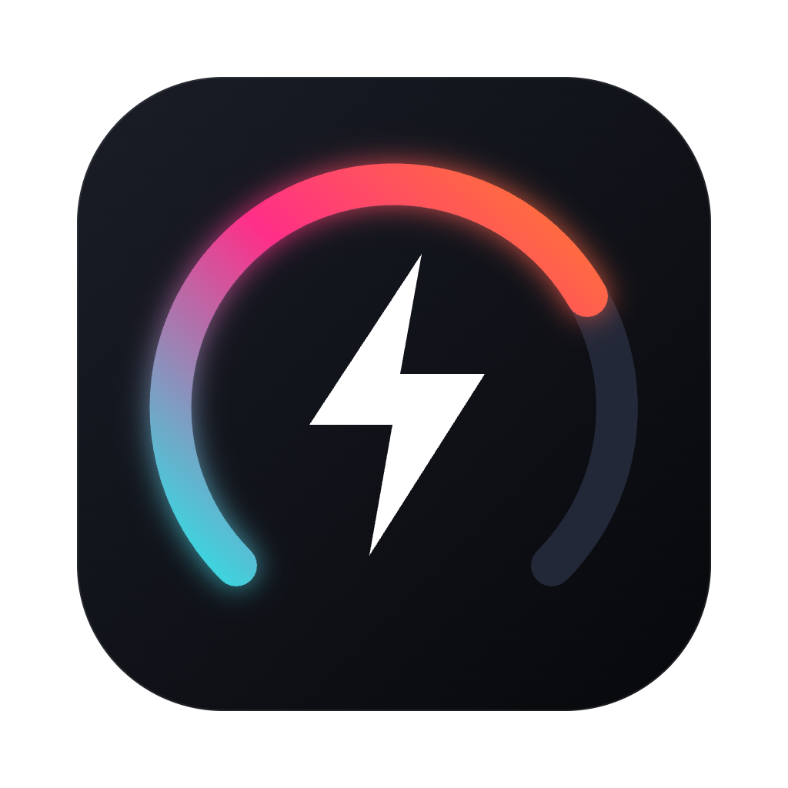
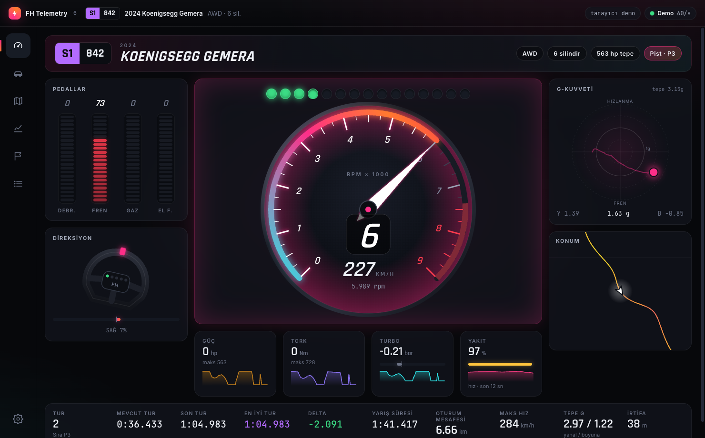
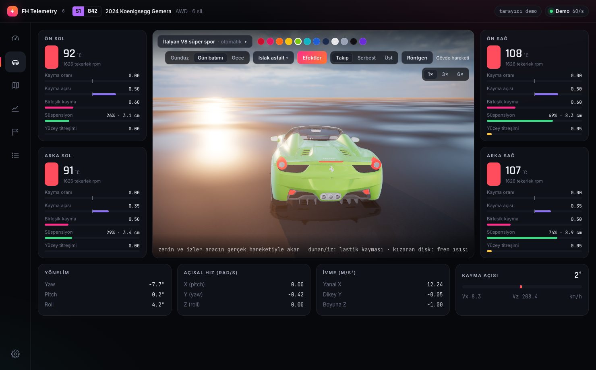
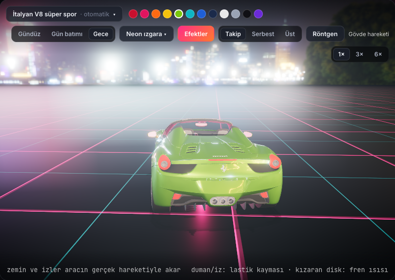
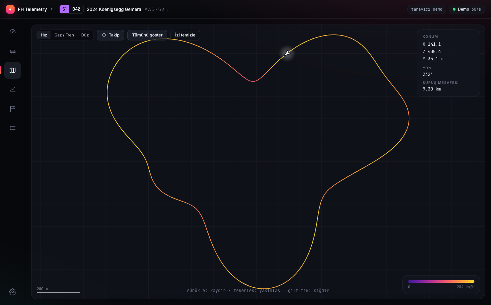
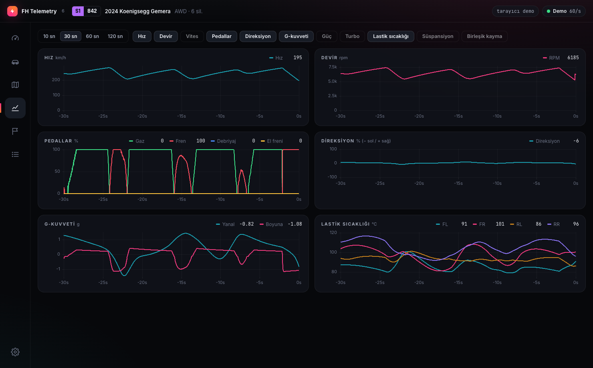

<div align="center">



# FH Telemetry — Forza Horizon 6 Telemetry Dashboard

**Free, open-source, real-time telemetry dashboard for Forza Horizon 6** (also reads Forza Horizon 5/4 and Forza Motorsport "Data Out").
Tachometer, live 3D car with real car models, track map, charts, lap & sprint timing, recording and replay.

**Windows · macOS · Linux · Android · iOS · iPadOS · any browser on your LAN**

[](https://github.com/dikeckaan/forza-horizon-6-telemetry-dashboard/actions/workflows/build.yml)
[](https://github.com/dikeckaan/forza-horizon-6-telemetry-dashboard/releases/latest)
[](LICENSE)

[**⬇ Download**](https://github.com/dikeckaan/forza-horizon-6-telemetry-dashboard/releases/latest) ·
[**▶ Try the web demo**](https://dikeckaan.github.io/forza-horizon-6-telemetry-dashboard/) ·
[Türkçe](#türkçe)



</div>

## Features

- **Live cockpit** — tachometer with shift lights and SHIFT warning, gear and speed, LED pedals (throttle, brake, clutch, handbrake), steering, G-force circle, power / torque / boost / fuel with sparklines, mini map.
- **Real car name** — the game only sends a number; the app knows all **671 Forza Horizon 6 cars** ("2019 Volkswagen Golf R", "2024 Koenigsegg Gemera", …).
- **Live 3D car** — body roll & pitch from suspension, spinning & steering wheels, drift angle, tyre smoke, skid marks, glowing brake discs, exhaust backfire, head/brake lights.
  - Real 3D models: two built in, **auto-download of the matching car from Sketchfab** (free account), or import any `.glb`.
  - Scenes: day, sunset, night city · Grounds: wet / dry asphalt, concrete, sand, snow, grass, neon grid · bloom, ambient occlusion, reflections · chase / orbit / top camera · x-ray mode.
- **Track map** coloured by speed or throttle/brake, follow mode, zoom & pan.
- **Charts** — speed, RPM, gear, pedals, steering, G-forces, power, boost, tyre temperatures, suspension, tyre slip.
- **Race & laps** — lap table, live delta to best lap, lap overlay; **sprint races** with position, % progress (route length is learned) and delta to your best run; rewinds handled.
- **Recording & replay** — every drive is saved automatically; replay at 0.5×–8×, export CSV, delete one or all.
- **Second screen** — turn on the LAN server and open the dashboard on any phone, tablet or PC browser by scanning a QR code.
- **Raw data** view with all 85+ packet fields, units (km/h / mph, °C / °F, hp / kW, bar / psi, Nm / lb·ft), UDP forwarding to other tools (e.g. SimHub).

| 3D car — sunset | 3D car — neon night |
|---|---|
|  |  |
| **Track map** | **Telemetry charts** |
|  |  |

## Download

Grab the file for your device from the [latest release](https://github.com/dikeckaan/forza-horizon-6-telemetry-dashboard/releases/latest):

| Platform | File | Notes |
|---|---|---|
| Windows 10/11 (x64, ARM64) | `…-windows-x64-setup.exe` or `…-portable.exe` | Unsigned: "More info → Run anyway" on SmartScreen |
| macOS (Apple Silicon & Intel) | `…-mac-arm64.dmg` / `…-mac-x64.dmg` | Unsigned: right-click → Open the first time |
| Linux | `.AppImage`, `.deb`, `.tar.gz` | `chmod +x` the AppImage |
| Android (phone & tablet) | `…-android.apk` | Allow "install unknown apps" |
| iOS / iPadOS | `…-ios-unsigned.ipa` | Needs re-signing (AltStore, Sideloadly or your Apple ID in Xcode). Easiest on iPad: use the **second screen** in a browser |

## Set up Forza Horizon 6

In the game: **Settings → HUD and Gameplay**

1. **Data Out**: On
2. **Data Out IP Address**: the IP shown in the app (Settings → Connection)
3. **Data Out IP Port**: `20440`

That's it — drive and the dashboard comes alive. Packets are the 324-byte "Dash" format (verified against real FH6 captures).

### Phone / tablet as a second screen

Desktop app → Settings → **Phone / tablet screen** → turn on → scan the QR code. Works on iPhone, iPad, Android and any browser on the same Wi-Fi, no install.

### Real 3D models of your car

Settings → **3D car models (Sketchfab)** → paste your free Sketchfab API token (sketchfab.com → Settings → Password & API). When you get in a new car the app finds and downloads the best-matching model. Models belong to their authors; most are licensed for personal use.

## Build from source

```bash
npm install
npm run dev        # desktop app with live reload
npm run dev:web    # UI only, in the browser, with a built-in driving simulator
npm test           # parser, lap/race tracking, recorder, 3D rig tests (real FH6 captures)
npm run dist       # desktop installers → release/

# mobile (Capacitor)
npx vite build && npx cap sync
npx cap open android   # or: npx cap open ios
```

Every push builds all platforms on GitHub Actions; tags `v*` publish a release.

**Stack:** Electron · React · TypeScript · three.js / react-three-fiber · uPlot · Capacitor (Android/iOS, native UDP plugin in `plugins/udp-telemetry`) · Vite · Vitest.

## Türkçe

**FH Telemetry**, Forza Horizon 6'nın "Veri Çıkışı" (Data Out) telemetrisini gerçek zamanlı gösteren ücretsiz ve açık kaynaklı bir paneldir. Devir saati, gerçek araç modelleriyle canlı 3D araç, harita, grafikler, tur ve sprint zamanlama, otomatik kayıt ve tekrar oynatma içerir. Windows, macOS, Linux, Android, iOS ve iPad'de çalışır; telefon ya da tablet ikinci ekran olarak tarayıcıdan da bağlanabilir. Arayüz Türkçedir.

Kurulum: [son sürümden](https://github.com/dikeckaan/forza-horizon-6-telemetry-dashboard/releases/latest) cihazına uygun dosyayı indir. Oyunda **Ayarlar › HUD ve Oynanış › Veri Çıkışı: Açık**, IP olarak uygulamada yazan adresi, port olarak `20440` gir.

## Credits & disclaimer

- Car ordinal list: [HDR's FH6 list](https://gist.github.com/HDR/0659d1717bc61504bf83750628963f4f).
- Built-in 3D models (CC BY 4.0) and sky/HDRI assets (CC0, Poly Haven) — see [`CREDITS.md`](src/renderer/public/models/CREDITS.md).
- Forza, Forza Horizon and all car names are trademarks of their respective owners. This is an unofficial fan project, not affiliated with or endorsed by Microsoft, Xbox Game Studios, Playground Games or Turn 10.

Code: [MIT](LICENSE).
